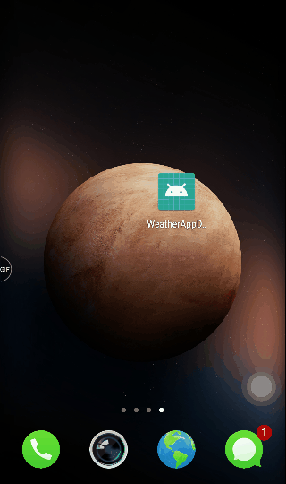

# Weather application by Daniel Ge(20161701)

That´s the weather applaction. When the network is connected, the weather can be refreshed as soon as the app opens or the button is clicked. And if the network is not connected it will not crash and there will be a toast inform the user that the network is not connected.
